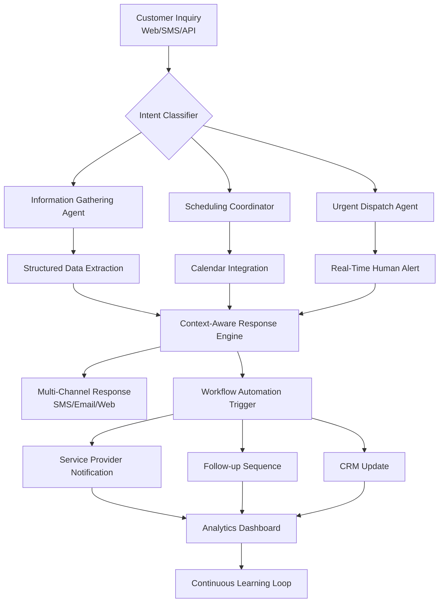

# 🧠 AI Customer Concierge

[](https://amukwiita.github.io/ai-service-dispatch/)

## 🌟 The Conversational Intelligence Layer for Modern Businesses

**AI Customer Concierge** is an autonomous communication orchestrator that transforms customer interactions into structured, actionable workflows. Unlike traditional service desks, this system functions as a cognitive partner—learning from conversations, anticipating needs, and executing follow-up actions with minimal human intervention. Designed for service-based businesses, it serves as the central nervous system for customer communication across web, SMS, and emerging messaging platforms.

Imagine a system that doesn't just respond to queries but understands context, remembers previous interactions, and proactively manages the entire customer journey from initial inquiry to service completion and beyond. That's the paradigm shift AI Customer Concierge delivers.

## 🚀 Immediate Access

[](https://amukwiita.github.io/ai-service-dispatch/)

## 📊 System Architecture

The system employs a multi-agent architecture where specialized AI modules collaborate to handle different aspects of the customer interaction lifecycle.



## 🛠️ Core Capabilities

### 🎯 Intelligent Intake & Triage
- **Contextual Understanding**: Goes beyond keywords to grasp customer sentiment, urgency, and implied needs.
- **Multi-Format Extraction**: Pulls structured data (dates, addresses, service types, budgets) from unstructured messages.
- **Automatic Prioritization**: Routes conversations based on urgency, customer value, and service type.

### 🤖 Autonomous Follow-Up Engine
- **Progressive Engagement**: Sends status updates, reminders, and satisfaction checks at optimal intervals.
- **Conditional Workflows**: "If the customer mentions water damage, immediately schedule inspection and notify emergency response team."
- **Natural Conversation Memory**: Remembers previous details across multiple conversation threads.

### 🌐 Unified Communication Hub
- **Channel-Agnostic Interface**: Conversations flow seamlessly between SMS, web chat, and future platforms.
- **Brand Voice Consistency**: Maintains your business's tone across all automated communications.
- **Human Handoff Protocol**: Smoothly escalates to human agents with full context transfer.

## 📁 Example Profile Configuration

Create a `business_profile.yaml` to customize your concierge:

```yaml
business:
  name: "Summit Valley Landscaping"
  service_categories:
    - emergency_tree_removal
    - seasonal_maintenance
    - landscape_design
  operating_hours:
    emergency: 24/7
    standard: "Mon-Fri 8am-6pm"
    
ai_concierge:
  primary_voice: "professional_helpful"
  escalation_threshold: 0.85
  supported_languages:
    - en
    - es
    - fr
    
  extraction_fields:
    - name: service_address
      required: true
      validation: "geocode"
    - name: preferred_date
      type: "datetime"
      flexibility_days: 14
    - name: budget_range
      type: "currency_range"
      
  automation_triggers:
    - condition: "service_category == 'emergency'"
      actions:
        - "notify_team_sms"
        - "create_priority_ticket"
        - "send_eta_update"
    - condition: "customer_sentiment < 0.3"
      actions:
        - "escalate_to_manager"
        - "apply_discount_offer"
        
  integrations:
    calendar: "google_business"
    crm: "hubspot"
    payment: "stripe"
    messaging:
      primary: "twilio"
      fallback: "whatsapp_business"
```

## 💻 Example Console Invocation

```bash
# Initialize with your business profile
ai-concierge init --profile ./business_profile.yaml

# Start the concierge service
ai-concierge start \
  --mode hybrid \
  --ai-providers openai claude \
  --fallback-strategy rotate \
  --analytics-enabled

# Monitor active conversations
ai-concierge monitor \
  --dashboard \
  --alert-threshold 5_min_response

# Generate monthly engagement report
ai-concierge report \
  --period monthly \
  --metrics "response_time,customer_sentiment,conversion_rate" \
  --output formats "pdf,csv"

# Train on historical conversations
ai-concierge train \
  --data ./past_conversations/ \
  --model custom_classifier \
  --validation-split 0.2
```

## 🖥️ OS Compatibility

| Platform | Status | Notes |
|----------|--------|-------|
| 🐧 Linux | ✅ Fully Supported | Ubuntu 20.04+, RHEL 8+ |
| 🍎 macOS | ✅ Fully Supported | Monterey 12.3+ with M1/M2 optimization |
| 🪟 Windows | ✅ Supported via WSL2 | Windows 10/11 with WSL2 Ubuntu |
| 🐋 Docker | ✅ Primary Deployment | Multi-arch images available |
| ☁️ Cloud | ✅ Kubernetes Ready | Helm charts provided |

## 🌈 Feature Spectrum

### 🧩 Core Intelligence Features
- **Dual AI Engine**: Leverages both OpenAI GPT-4 and Claude 3 for balanced decision-making
- **Adaptive Routing**: Conversations dynamically assigned to the most suitable AI based on task type
- **Confidence-Based Escalation**: Automatically flags low-confidence responses for human review
- **Continuous Learning**: Improves from corrected responses without manual retraining

### 🔌 Integration Ecosystem
- **Calendar Synchronization**: Reads availability and books appointments directly
- **Payment Coordination**: Sends secure payment links upon service agreement
- **Inventory Checking**: Verifies part/service availability in real-time
- **Provider Dispatch**: Notifies field technicians with complete job details

### 📊 Analytics & Insights
- **Conversation Intelligence**: Identifies common objections and successful responses
- **Peak Demand Forecasting**: Predicts busy periods based on conversation patterns
- **Customer Sentiment Tracking**: Monitors satisfaction across the service journey
- **Automation ROI Calculator**: Measures time saved versus manual handling

### 🔒 Security & Compliance
- **End-to-End Encryption**: All customer data encrypted in transit and at rest
- **Data Minimization**: Extracts only necessary information for service delivery
- **Consent Management**: Tracks and honors communication preferences
- **Audit Trail**: Complete log of all AI decisions and human overrides

## 🎯 SEO-Optimized Value Propositions

AI Customer Concierge serves as your always-available digital representative, capturing leads that arrive after hours, qualifying them with intelligent questioning, and scheduling appointments directly into your calendar. This intelligent customer service automation platform transforms how home service businesses manage client communications, reducing missed opportunities and administrative overhead while providing consistently exceptional customer experiences.

For plumbing companies, electrical services, HVAC specialists, and landscaping businesses, this AI-powered communication system delivers 24/7 customer support without requiring staff to be constantly on call. The automated scheduling and follow-up features ensure no customer inquiry falls through the cracks, while the multilingual support expands your market reach within diverse communities.

## 🔑 API Integration Details

### OpenAI Configuration
```yaml
openai:
  model: "gpt-4-turbo"
  temperature: 0.7
  max_tokens: 500
  specialized_tasks:
    sentiment_analysis: true
    structured_extraction: true
    multilingual_translation: true
```

### Claude API Integration
```yaml
claude:
  model: "claude-3-opus-20240229"
  thinking_tokens: 1024
  strengths:
    - complex_reasoning
    - instruction_following
    - safety_filtering
  fallback_for:
    - financial_calculations
    - policy_explanations
    - escalation_scenarios
```

### Hybrid Decision Engine
The system employs a unique voting mechanism where both AI providers process complex queries independently, then a reconciliation layer determines the optimal response based on confidence scores, response coherence, and historical accuracy for similar queries.

## 📈 Deployment Scenarios

### Single Business Implementation
Perfect for individual contractors or small service businesses needing to appear larger and more responsive than their actual team size allows.

### Multi-Business Platform
Service aggregators can deploy separate instances for each provider while maintaining centralized monitoring and quality control.

### White-Label Solution
Marketing agencies can rebrand the concierge for their clients, creating a value-added service that differentiates their offerings.

## ⚠️ Important Considerations

### System Requirements
- Minimum 4GB RAM for basic operation, 8GB recommended for concurrent conversations
- Stable internet connection for AI API communication
- 10GB storage for conversation history and analytics data

### Implementation Timeline
- **Day 1**: Basic setup and profile configuration
- **Week 1**: Training on your specific service terminology
- **Month 1**: Full automation of initial customer inquiries
- **Quarter 1**: Comprehensive workflow automation

### Cost Structure
While the software itself is openly accessible, operational costs include:
- AI API usage fees (based on conversation volume)
- SMS/telephony costs (carrier-dependent)
- Optional hosting fees for cloud deployment

## 📄 License

This project is licensed under the MIT License - see the [LICENSE](LICENSE) file for complete details. The license grants permission for commercial use, modification, distribution, and private use, with the only requirement being preservation of copyright and license notices.

Copyright 2026 AI Customer Concierge Contributors

## 🛡️ Disclaimer

AI Customer Concierge is designed as an augmentation tool for business communications, not a replacement for human judgment in critical situations. The system operates best with appropriate human oversight, particularly for complex customer issues, sensitive matters, or legal considerations. Businesses remain responsible for all communications sent through the system and should establish review protocols for escalated conversations.

Performance varies based on training data, configuration, and the specific nature of your business communications. Regular monitoring and adjustment are recommended, especially during initial deployment phases. The developers assume no liability for business decisions made based on the system's recommendations or for communications sent through the platform.

---

## 🚀 Ready to Transform Your Customer Communications?

[](https://amukwiita.github.io/ai-service-dispatch/)

**Begin your journey toward intelligent customer engagement today.** Deploy your AI Customer Concierge and experience the transformation from reactive support to proactive customer partnership.